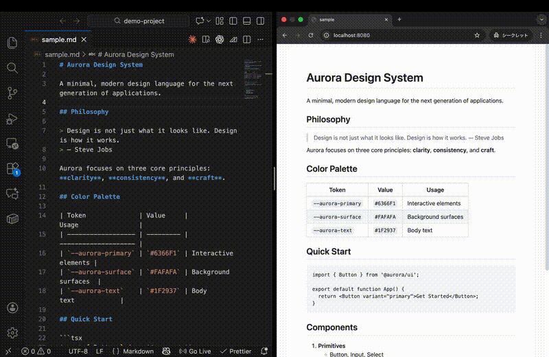
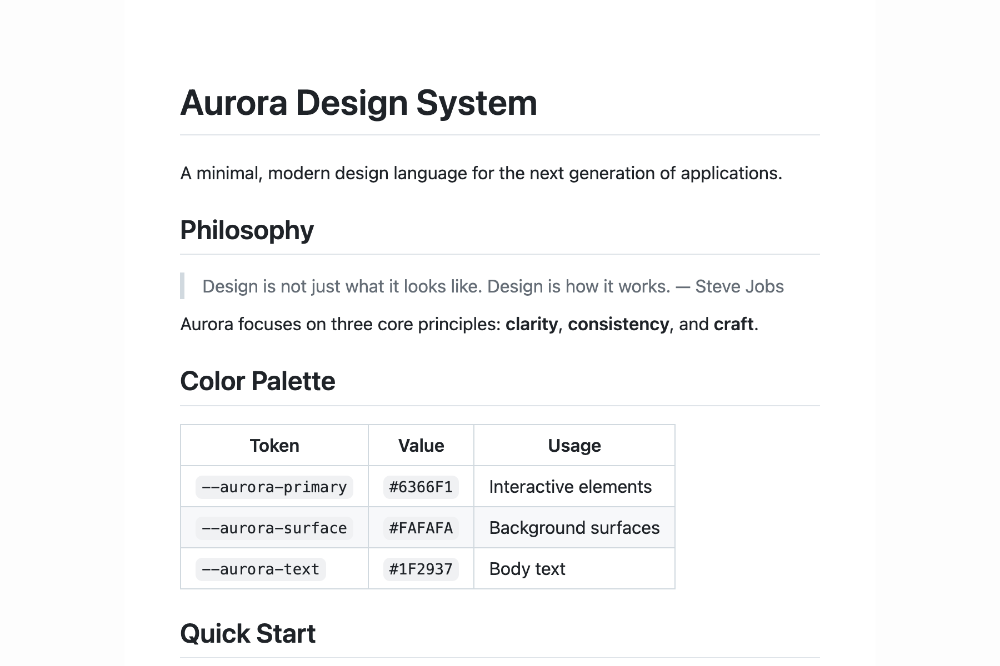
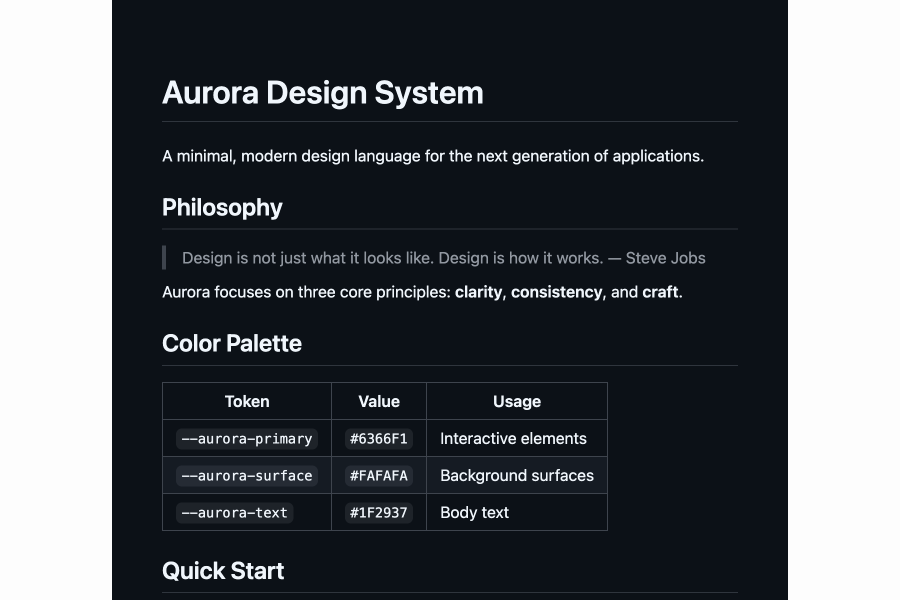
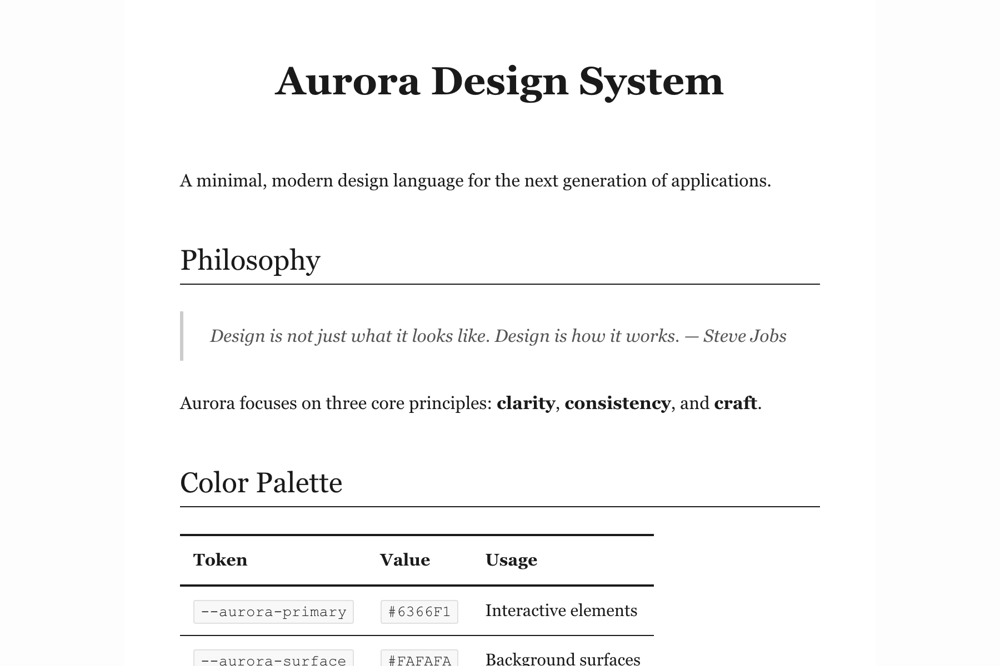
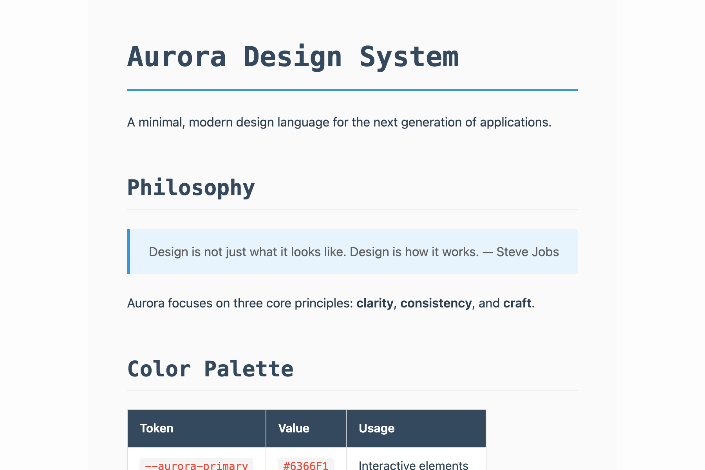

# vimd

🌐 [English](README-en.md) | 日本語

> 書きながら見る。Markdownプレビュー

[](https://www.npmjs.com/package/vimd)
[](https://opensource.org/licenses/MIT)
[](https://nodejs.org/)

---

## デモ



<details>
<summary>MP4版をダウンロード</summary>

[demo.mp4](assets/demo.mp4)

</details>

---

## テーマ

<details open>
<summary><strong>GitHub</strong> (デフォルト)</summary>



</details>

<details>
<summary><strong>Dark</strong></summary>



</details>

<details>
<summary><strong>Academic</strong></summary>



</details>

<details>
<summary><strong>Minimal</strong></summary>


</details>

<details>
<summary><strong>Technical</strong></summary>



</details>

---

## クイックスタート

### 必要要件

- **Node.js** >= 18.0.0
- **pandoc** >= 2.0

```bash
# pandocのインストール
brew install pandoc        # macOS
sudo apt install pandoc    # Ubuntu/Debian
choco install pandoc       # Windows
```

### インストール

```bash
npm install -g vimd
```

### 使い方

```bash
# ライブプレビューを開始
vimd dev draft.md

# 静的HTMLを生成
vimd build draft.md

# テーマを変更
vimd theme

# 設定を編集
vimd config
```

---

## コマンド

| コマンド | 説明 |
|---------|------|
| `vimd dev <file>` | ライブプレビューサーバーを起動 |
| `vimd build <file>` | 静的HTMLを生成 |
| `vimd theme` | テーマを対話的に変更 |
| `vimd config` | 設定を対話的に編集 |

### オプション

```bash
vimd dev draft.md --port 3000      # ポート指定
vimd dev draft.md --theme dark     # テーマ指定
vimd dev draft.md --no-open        # ブラウザを開かない
vimd build draft.md -o output.html # 出力先指定
```

---

## 設定

グローバル設定は `~/.vimd/config.js` に保存されます。

```javascript
export default {
  theme: 'github',
  port: 8080,
  open: true,
};
```

詳細な設定オプションは [docs/api.md](docs/api.md) を参照してください。

---

## Why vimd?

| 特徴 | vimd | 他のツール |
|------|------|-----------|
| セットアップ | `npm i -g vimd` | 複雑な設定が必要な場合も |
| 変換品質 | pandoc (高品質) | 様々 |
| テーマ | 5種類組み込み | 別途設定が必要 |
| 設定ファイル | プロジェクト外 (`~/.vimd/`) | プロジェクト内が多い |
| ライブリロード | 自動 | 手動リロードが必要な場合も |

---

## ドキュメント

- [開発ガイド](docs/development.md) - 開発環境構築
- [アーキテクチャ](docs/architecture.md) - プロジェクト構造
- [APIリファレンス](docs/api.md) - 詳細なオプション
- [テスト](docs/testing.md) - テスト構成
- [トラブルシューティング](docs/troubleshooting.md) - よくある問題

---

## リンク

- [CONTRIBUTING.md](CONTRIBUTING.md) - コントリビューションガイド
- [CHANGELOG.md](CHANGELOG.md) - 変更履歴
- [GitHub](https://github.com/notokeishou/vimd)
- [npm](https://www.npmjs.com/package/vimd)

---

## ライセンス

MIT © notokeishou
