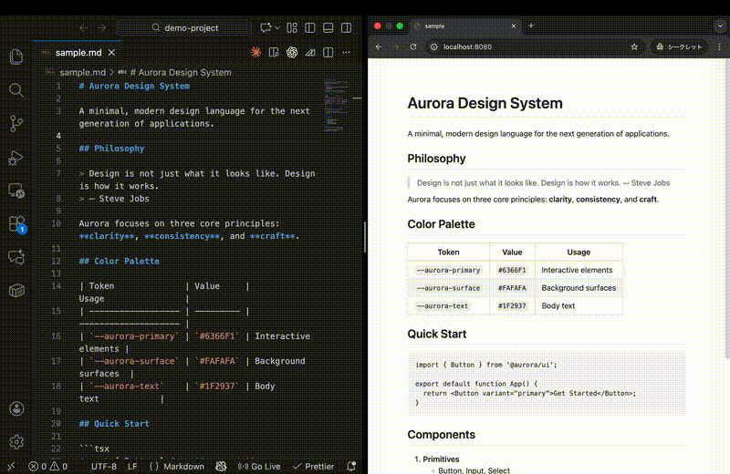
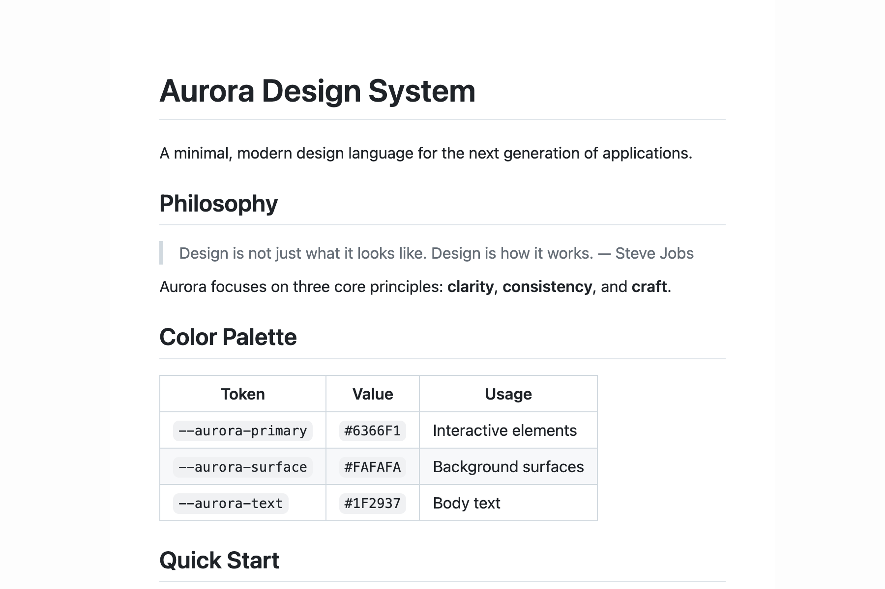
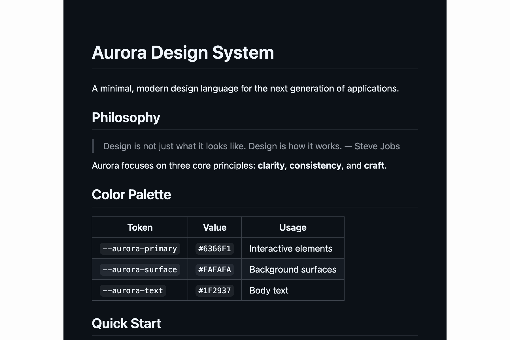
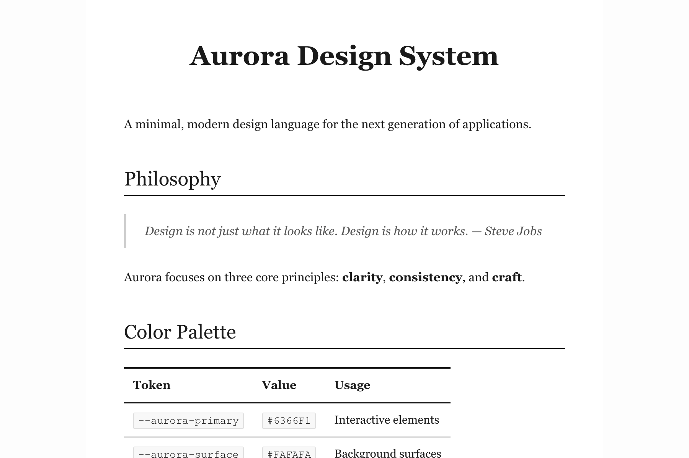
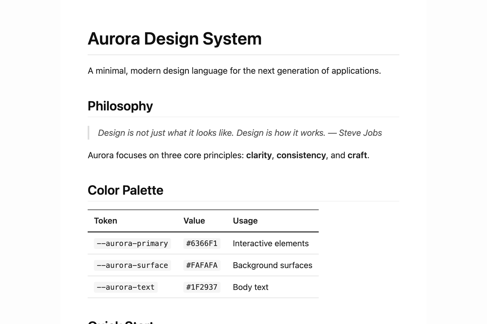
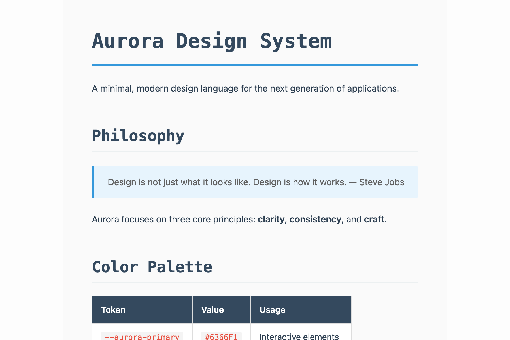

# vimd

🌐 [English](README-en.md) | 日本語

> 書きながら見る。Markdownプレビュー

[](https://www.npmjs.com/package/vimd)
[](https://opensource.org/licenses/MIT)
[](https://nodejs.org/)

---

## デモ



---

## テーマ

<details open>
<summary><strong>GitHub</strong> (デフォルト)</summary>



</details>

<details>
<summary><strong>Dark</strong></summary>



</details>

<details>
<summary><strong>Academic</strong></summary>



</details>

<details>
<summary><strong>Minimal</strong></summary>



</details>

<details>
<summary><strong>Technical</strong></summary>



</details>

---

## クイックスタート

### 必要要件

- **Node.js** >= 18.0.0
- **pandoc** >= 2.0（オプション、高品質ビルド時のみ）

### インストール

```bash
npm install -g vimd
```

**現在のバージョン: v0.4.1**

v0.2.0 からは **pandoc なしで利用可能** になりました。
高品質な出力が必要な場合のみ pandoc をインストールしてください。

```bash
# pandocのインストール（オプション）
brew install pandoc        # macOS
sudo apt install pandoc    # Ubuntu/Debian
choco install pandoc       # Windows
```

### 使い方

```bash
# ライブプレビューを開始（pandoc不要、高速）
vimd dev draft.md

# 静的HTMLを生成（pandoc使用、高品質）
vimd build draft.md

# 高速ビルド（pandoc不要）
vimd build draft.md --fast

# テーマを変更
vimd theme

# 設定を編集
vimd config
```

---

## バージョン情報

**現在のバージョン: v0.4.1**

v0.4.x は LaTeX ドキュメントサポートを追加したバージョンです。

```bash
npm install -g vimd
```

---

## コマンド

| コマンド            | 説明                           |
| ------------------- | ------------------------------ |
| `vimd dev <file>`   | ライブプレビューサーバーを起動 |
| `vimd dev <folder>` | フォルダモードを起動           |
| `vimd build <file>` | 静的HTMLを生成                 |
| `vimd theme`        | テーマを対話的に変更           |
| `vimd config`       | 設定を対話的に編集             |
| `vimd kill`         | 実行中のセッションを終了       |
| `vimd reset`        | 設定をデフォルトにリセット     |

### オプション

```bash
# dev コマンド
vimd dev draft.md --port 3000      # ポート指定
vimd dev draft.md --theme dark     # テーマ指定
vimd dev draft.md --no-open        # ブラウザを開かない
vimd dev draft.md --pandoc         # pandocパーサーを使用

# build コマンド
vimd build draft.md -o output.html # 出力先指定
vimd build draft.md --fast         # markdown-itで高速ビルド
vimd build draft.md --theme dark   # テーマ指定

# kill コマンド
vimd kill                          # 全セッションを終了
vimd kill --port 38080             # 特定ポートのセッションを終了

# reset コマンド
vimd reset                         # 設定をリセット（確認あり）
vimd reset --yes                   # 確認なしでリセット
```

---

## 設定

グローバル設定は `~/.vimd/config.js` に保存されます。

```javascript
export default {
  theme: 'github',
  port: 38080, // デフォルト: 38080（v0.2.1で変更）
  open: true,
  devParser: 'markdown-it', // dev用パーサー（デフォルト: markdown-it）
  buildParser: 'pandoc', // build用パーサー（デフォルト: pandoc）
};
```

### パーサー設定

| パーサー      | 特徴             | 用途               |
| ------------- | ---------------- | ------------------ |
| `markdown-it` | 高速、pandoc不要 | 開発時のプレビュー |
| `pandoc`      | 高品質、多機能   | 最終出力の生成     |

詳細な設定オプションは [docs/ja/api.md](docs/ja/api.md) を参照してください。

### 数式サポート

vimd は MathJax を使用した TeX 数式表示に対応しています（v0.3.12以降）。

```markdown
インライン数式: $E = mc^2$

ブロック数式:
$$
\int_0^\infty e^{-x^2} dx = \frac{\sqrt{\pi}}{2}
$$
```

bussproofs（証明図）にも対応しています:

```markdown
$$
\begin{prooftree}
\AxiomC{$A$}
\AxiomC{$B$}
\BinaryInfC{$A \land B$}
\end{prooftree}
$$
```

数式サポートの設定:

```javascript
// ~/.vimd/config.js
export default {
  math: {
    enabled: true,      // デフォルト: true
    engine: 'mathjax',  // 'mathjax' または 'katex'
  },
};
```

### LaTeX ドキュメントサポート

vimd は `.tex` ファイルのプレビューに対応しています（v0.4.0以降）。

```bash
# LaTeX ファイルのライブプレビュー
vimd dev thesis.tex

# LaTeX ファイルを HTML に変換
vimd build thesis.tex
```

LaTeX ファイルは自動的に検出され、pandoc を使用して変換されます。

**対応する拡張子**:
- `.tex`
- `.latex`

**注意**: LaTeX プレビューには pandoc が必須です。pandoc がインストールされていない場合、インストールガイドが表示されます。

### フォルダモード

vimd はフォルダ内の複数ファイルを同一ポートで切り替えながらプレビューできます（v0.5.0以降）。

```bash
# カレントディレクトリをプレビュー
vimd dev .

# 指定フォルダをプレビュー
vimd dev ./docs
```

VSCode風のサイドバーでファイルを選択し、リアルタイムでプレビューを確認できます。

**対応する拡張子**:
- `.md` (Markdown)
- `.tex`, `.latex` (LaTeX)

**機能**:
- ツリー形式のファイル表示（フォルダ展開/折りたたみ可能）
- サイドバーのリサイズ（ドラッグで幅変更）
- キーボードショートカット（Ctrl+B でサイドバー表示/非表示）
- ファイル変更時の自動リロード

---

## Why vimd?

| 特徴           | vimd                        | 他のツール                 |
| -------------- | --------------------------- | -------------------------- |
| セットアップ   | `npm i -g vimd`             | 複雑な設定が必要な場合も   |
| 外部依存       | なし（pandocはオプション）  | pandoc必須が多い           |
| 変換品質       | markdown-it / pandoc 選択可 | 固定                       |
| テーマ         | 5種類組み込み               | 別途設定が必要             |
| 設定ファイル   | プロジェクト外 (`~/.vimd/`) | プロジェクト内が多い       |
| ライブリロード | 自動                        | 手動リロードが必要な場合も |

---

## ドキュメント

- [開発ガイド](docs/ja/development.md) - 開発環境構築
- [アーキテクチャ](docs/ja/architecture.md) - プロジェクト構造
- [APIリファレンス](docs/ja/api.md) - 詳細なオプション
- [テスト](docs/ja/testing.md) - テスト構成
- [トラブルシューティング](docs/ja/troubleshooting.md) - よくある問題
- [v0.3.0 リリースノート](docs/ja/releases/v0.3.0.md) - WebSocket Direct Communication
- [v0.2.0 リリースノート](docs/ja/releases/v0.2.0.md) - Dual Parser System

---

## リンク

- [CONTRIBUTING.md](CONTRIBUTING.md) - コントリビューションガイド
- [CHANGELOG.md](CHANGELOG.md) - 変更履歴
- [GitHub](https://github.com/notokeishou/vimd)
- [npm](https://www.npmjs.com/package/vimd)

---

## ライセンス

MIT © notokeishou
